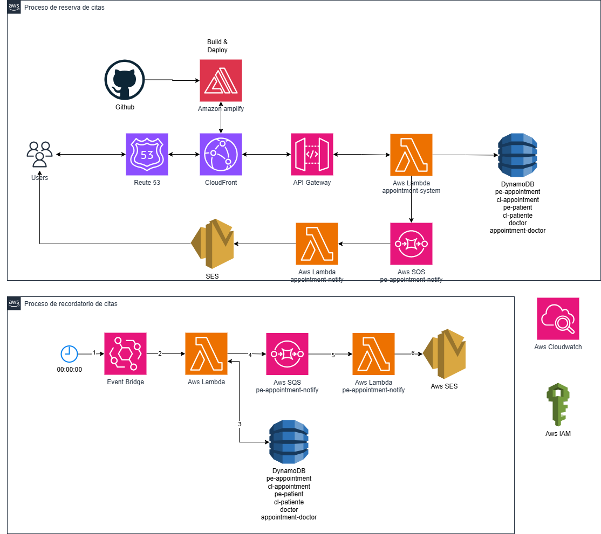

# RETO Sistema de Agendamiento de Citas Médicas Multinacional

## Consideraciones

### Contexto

Una compañía de seguros necesita desarrollar un sistema de agendamiento de citas médicas que funcione en múltiples países, inicialmente Perú y Chile.

### Objetivo

- El sistema debe ser escalable, confiable y altamente disponible.
- La solución debe ser capaz de manejar diferentes lógicas de procesamiento por país
  (Perú, Chile, etc).
- El software también debe manejar los estados de las solicitudes (Registrado, Pendiente,
  Asignado, etc).

## Desarrollo

### 1. Arquitectura



El objetivo de la siguiente arquitectura es que un sistema front de reserva de citas médica en ReactJS o NextJs se disponibilice mediante AWS amplify para hacer el build y deploy, y posteriormente apoyarnos en cloudFront para archivos estáticos o dinámicos se entreguen más rápido y con mayor disponibilidad.

El front podrá hacer uso de una API para poder hacer las operaciones de crear una cita, consultar una cita, consultar citas segun el estado, notificar citas, asignar citas a un médico y enviar notificaciones de recordatorio de citas. Para ello la arquitectura de la API será mediante el uso de los siguientes servicios:

- **API Gateway:** Nos va permitir configurar la API para el servicio.
- **AWS Lambda:** La lambda al ser onDemand nos va permitir escalar verticalmente en función a la demanda del servicio y esto nos permitirá optimizar costos por uso del servicio.
- **Lambda layer**
- **DynamoDb:** Es ideal para este proyecto por su capacidad de manejar datos distribuidos a gran escala con baja latencia, integración nativa con AWS y administración simplificada
- **SQS:** Es ideal para trabajar en arquitectura por eventos y lo usaremos para encolar notificaciones de citas en función al pais para luego procesarlos.
- **SES:** Se hará uso de SES para manejar las notificaciones por correo electrónico, lo cual es esencial para la gestión eficiente de un sistema de citas médicas multinacional.
- **Event Bridge:** Event Bridge nos permitirá ejecutar tareas automáticas segun la programación para que pueda notificar recordatorios de citas del día y así mejorar la experiencia del usuario.
- IAM rol y policies
- y Cloudwatch para el monitoreo

Además de estos servicios, la autenticación puede gestionarse utilizando AWS Cognito o mediante el uso de Bearer tokens.

### 2. Manejo de Datos

Para el agendamiento de citas se tiene como objetivo separar el registro en tablas diferentes por pais para así tener una mejor gestion de las citas, disminuir y los tiempo de latencia de la respuesta de consulta o registro de una cita.
Las citas se almacenarán de la siguiente manera tanto en la tabla pe-appointment y cl-appointment

Estrutura de la tabla **pe-appointment** y **cl-appointment**

- **id**: Campo compuesto de YYYYMMDD-{documento}
- **document**: Número de documento del paciente
- **patient**: Nombre del paciente
- **speciality**: Especialidad de la cita
- **status**: Registrado, Asignado y Completado
- **created_at**: Fecha de registro de la solicitud cita
- **date**: id de la cita de la tabla appointment-doctor
- **update_at**: Fecha de actualización

Estrutura de la tabla **doctor**

- **id**: Campo compuesto de {country}-{speciality}-{document}
- **country**: País pe / cl
- **document**: Número de documento del medico
- **name**: Nombre completo del médico
- **speciality**: Especialidad de la cita

Estrutura de la tabla **pe-patient** y **cl-patient**

- **document**: Número de documento del paciente
- **name**: Nombre completo del paciente

Estrutura de la tabla **appointment-doctor**. El objetivo es que cadá medico programe los horarios disponibles con antelación.

- **id**: Campo compuesto de {id de la tabla doctor}-{timestamp de date + time}
- **date**: Fecha de horario de cita disponible del médico
- **doctor**: id de la tabla doctor
- **isAvailable**: Estado de la cita programada por el médico (true / false)
- **time**: Horá de la cita programada

Se puede agregar mas tablas para cubrir el manejo de autentificación y autorización del servicio.

### 3. Procesamiento por País

Para diferenciar el registro de citas según el país, se pueden configurar diferentes endpoints con la siguiente estructura:
https://dominio/{country}/endpoint. Esto permite identificar claramente a qué país pertenece cada cita.

Es importante considerar que el frontend puede determinar la localización del usuario automáticamente o permitir una configuración manual para seleccionar el país de la cita y luego configurar el endpoint.

Incluir el país en el path del endpoint ofrece dos opciones de implementación:

- Usar una única Lambda con lógica personalizada para procesar las citas según el país.
- Configurar múltiples Lambdas, una por país, para manejar de manera independiente la lógica de procesamiento de las citas.

### 4. Escalabilidad y Rendimiento

En el diseño del sistema de citas médicas multinacional basado en AWS, los posibles cuellos de botella están relacionados con la infraestructura subyacente, las dependencias entre servicios y las cargas variables. A continuación, se identifican los puntos críticos y se proponen soluciones.

| **Componente**  | **Cuello de Botella**                    | **Soluciones**                                                                                                                                             |
| --------------- | ---------------------------------------- | ---------------------------------------------------------------------------------------------------------------------------------------------------------- |
| **API Gateway** | Límite de solicitudes, latencia          | - Habilitar caché en API Gateway.                                                                                                                          |
| **Lambda**      | Cold starts, concurrencia limitada       | - Habilitar Provisioned Concurrency. <br> - Aumentar límites de concurrencia. <br> - Dividir funciones en tareas específicas.                              |
| **SQS**         | Latencia en consumo, mensajes acumulados | - Incrementar consumidores (Lambdas paralelas). <br> - Configurar DLQs para mensajes no procesados. <br> - Usar alarmas de CloudWatch para monitorear.     |
| **SES**         | Límite de envío                          | - Solicitar aumento de cuota de envío. <br> - Procesar correos de forma asíncrona usando SQS.                                                              |
| **Monitoreo**   | Falta de visibilidad                     | - Configurar métricas y logs en CloudWatch. <br> - Implementar AWS X-Ray para rastreo de solicitudes. <br> - Crear alarmas proactivas para métricas clave. |

### 5. Seguridad y Cumplimiento

Para manejar los datos sensibles como información personal de pacientes, médicos y detalles de citas de puede tomar las siguientes medidas:

#### Control de Acceso:

Las siguientes medidas nos asegurarán que cada componente tenga solo los permisos necesarios para operar.

- Configurar políticas IAM con principio de privilegio mínimo.
- Usar roles específicos para cada Lambda y servicio.

#### Tokenización:

Para poder evita manejar datos sensibles directamente en la API, reduciendo el riesgo de exposición, se puede hacer uso de bearer tokens

#### Auditoría y Monitoreo:

Para poder tener una visibilidad y rastreo de actividades sospechosas o no autorizadas se puede habilitar AWS CloudTrail para rastrear accesos y cambios.

#### Protección contra Amenazas

Para protegernos contra ataques como SQL Injection y Cross-Site Scripting, se puede:

- Habilitar AWS WAF para proteger API Gateway contra ataques comunes.
- Limitar el acceso por IP o región.

#### Respaldo y Recuperación

Para asegura que los datos puedan recuperarse en caso de pérdida accidental o ataque malicioso, se debe de:

- Configurar backups automáticos en DynamoDB.
- Usar AWS Backup para recuperación ante desastres.

### 6. Monitoreo y Manejo de Errores

#### 6.1. Monitoreo del Sistema

El monitoreo es esencial para garantizar que el sistema funcione correctamente y permita identificar problemas de manera proactiva. Para ello se puede hacer uso de AWS CloudWatch Logs y AWS CloudWatch Metrics, para poder capturar logs generados por Lambdas, API Gateway, DynamoDB, y otros servicios, y Monitorear métricas clave como latencia, concurrencia, solicitudes fallidas y tiempos de ejecución.

#### 6.2. Manejo de Errores y Reintentos

El manejo de errores garantiza la resiliencia del sistema ante fallos. Las estrategias de reintento son esenciales para asegurar que las operaciones críticas (como el envío de notificaciones) no se pierdan.

- Reintentos automáticos: Se puede configurar AWS Lambda para realizar reintentos automáticos para errores asincrónicos.
- Dead Letter Queues (DLQs): En caso que trabajemos con SQS y tengamos problemas de procesar evento, se puede configurar una DLQ para almacena eventos que no pueden procesarse y después reinyectarlos en la cola para que se procese posteriormente.
- Circuit Breaker: Se puede implementar un circuit breaker en los servicios críticos para dar respuestas cacheadas en caso que falle algun servicio como dynamoDb o SES.

- Notificaciones de Errores: Se puede configurar SNS para enviar alertas por correo o SMS cuando se detecten errores críticos.

### 7. Código de Muestra

El la solución consta de 2 proyectos: medical-appointment-system y medical-appointment-layer para poder crear la API y los servicios necesarios para el procesamiento del agendamiento de citas.

#### medical-appointment-layer

Este proyecto contiene la lambda layer a utilizarse en las lambdas del proyecto medical-appointment-system.
Dentro del proyecto se encuentrá un README.md para poder ejectutarlo y tiene mas detalle de su objetivo.

#### medical-appointment-system

Este proyecto depende de que el proyecto medical-appointment-layer se ejecute primero, ya que este genera la Layer necesaria para optimizar el manejo de paquetes utilizados en las Lambdas. Una vez creada la Layer, se puede integrar en las Lambdas de este proyecto, reduciendo el tamaño de los despliegues y promoviendo la reutilización de dependencias.

Además, las Lambdas de este proyecto están configuradas para trabajar con TypeScript, lo que permite aprovechar las ventajas de un lenguaje tipado, como la detección temprana de errores y un código más estructurado y mantenible

_(Nota) Para el desarrollo del servicio en la lambda se hizo de la forma mas sencilla posible por la presión del tiempó, pero para poder mejorarlo se puede hacer uso de diferentes patrones de diseño como por ejemplo factory y proxy para lograr que el servicio sea dinámico por paises, patron repository para disminuir la dependencia entre los servicios. Incluso utilizar diferentes arquitecturas como eventDrive o hexagonal_

### 8. Consideraciones Adicionales

Manejo de la Latencia de Respuesta al Usuario

#### Causas Comunes

1. **Cold Starts:** Retrasos por inicialización de Lambdas inactivas.
2. **Latencia en Bases de Datos:** Consultas complejas o mal optimizadas.
3. **Procesos Sincrónicos:** Tareas como envío de correos.
4. **Sobrecarga de Recursos:** Tráfico elevado sin escalabilidad adecuada.

#### Estrategias

| **Estrategia**              | **Descripción**                                                        |
| --------------------------- | ---------------------------------------------------------------------- | --- |
| **Provisioned Concurrency** | Evita cold starts manteniendo Lambdas "calientes".                     |
| **Cacheo**                  | Usar API Gateway Cache y DynamoDB DAX para consultas repetitivas.      |
| **Procesos Asíncronos**     | Desacoplar tareas pesadas usando SQS para respuestas inmediatas.       |
| **Edge Locations**          | Implementar AWS CloudFront y Global Accelerator para reducir latencia. |     |
| **Monitoreo**               | Configurar métricas y alarmas en CloudWatch.                           |

#### Diseño Propuesto

1. **Sincrónico:** Retornar confirmaciones inmediatas al cliente tras guardar datos en DynamoDB.
2. **Asíncrono:** Procesar tareas pesadas como notificaciones con SQS y SES.

## Instalación y despliegue del proyecto

### Despliegue del proyecto medical-appointment-layer

Para desplegar este proyecto se puede seguir los pasos del README.md que se encuentra dentro del proyecto

### Despliegue del proyecto medical-appointment-system

Para desplegar este proyecto es necesario:

Primero estar en el path `/medical-appointment-system/appointment-system/` y ejecutar el siguiente comando:

```
npm run build
```

Luego volver a la carpeta `/medical-appointment-system` y ejecutar el siguiente comando:

```
serverless deploy
```

Esto permitira desplegar la infraestructura mediante AWS CloudFormation, y cuando finalize podremos tener la API con los Endpoinst, ademas de la creación de los recursos mensionados en la imagen de la arquitectura.

En esta ocasión solo se levanto la infraestructura necesaria para reservar y notificar una cita.

**Ejemplo:**

Creación de Cita: POST https://a80dat35wd.execute-api.us-east-1.amazonaws.com/desa/pe/system/appointment

#### Carga de datos dummy

La carga de datos para poder hacer la prueba se hará mediante AWS CloudShell. Para ello ingresamos mediante la consola de AWS y a AWS CloudShell.

1. Escribimos en la terminal `nano data.json` y luego enter. Este permitira crear un archivo para luego llenarlos de data.

2. Escribe el siguiente contenido en el archivo o solo copia y pega en la terminal:

```json
{
  "doctor": [
    {
      "PutRequest": {
        "Item": {
          "id": { "S": "pe-medicina-interna-9999234" },
          "country": { "S": "pe" },
          "document": { "S": "9999234" },
          "name": { "S": "Dr. ANDRES PERICH DIAS" },
          "speciality": { "S": "medicina-interna" }
        }
      }
    },
    {
      "PutRequest": {
        "Item": {
          "id": { "S": "cl-medicina-interna-9999234" },
          "country": { "S": "cl" },
          "document": { "S": "9999234" },
          "name": { "S": "Dr. ANDRES PERICH DIAS" },
          "speciality": { "S": "medicina-interna" }
        }
      }
    },
    {
      "PutRequest": {
        "Item": {
          "id": { "S": "pe-cardiologia-9999235" },
          "country": { "S": "pe" },
          "document": { "S": "9999235" },
          "name": { "S": "Dr. MARÍA LOPEZ TORRES" },
          "speciality": { "S": "cardiologia" }
        }
      }
    },
    {
      "PutRequest": {
        "Item": {
          "id": { "S": "pe-pediatria-9999236" },
          "country": { "S": "pe" },
          "document": { "S": "9999236" },
          "name": { "S": "Dr. JUAN CARLOS VEGA" },
          "speciality": { "S": "pediatria" }
        }
      }
    }
  ],
  "appointment-doctor": [
    {
      "PutRequest": {
        "Item": {
          "id": { "S": "pe-medicina-interna-9999234-1732629600" },
          "date": { "S": "2024-11-26" },
          "doctor": { "S": "pe-medicina-interna-9999234" },
          "isAvailable": { "BOOL": false },
          "time": { "S": "09:00" }
        }
      }
    },
    {
      "PutRequest": {
        "Item": {
          "id": { "S": "pe-medicina-interna-9999234-1732633200" },
          "date": { "S": "2024-11-26" },
          "doctor": { "S": "pe-medicina-interna-9999234" },
          "isAvailable": { "BOOL": true },
          "time": { "S": "10:00" }
        }
      }
    },
    {
      "PutRequest": {
        "Item": {
          "id": { "S": "pe-medicina-interna-9999234-1732636800" },
          "date": { "S": "2024-11-26" },
          "doctor": { "S": "pe-medicina-interna-9999234" },
          "isAvailable": { "BOOL": true },
          "time": { "S": "11:00" }
        }
      }
    },
    {
      "PutRequest": {
        "Item": {
          "id": { "S": "pe-medicina-interna-9999234-1732640400" },
          "date": { "S": "2024-11-26" },
          "doctor": { "S": "pe-medicina-interna-9999234" },
          "isAvailable": { "BOOL": true },
          "time": { "S": "12:00" }
        }
      }
    },
    {
      "PutRequest": {
        "Item": {
          "id": { "S": "pe-medicina-interna-9999234-1732719600" },
          "date": { "S": "2024-11-27" },
          "doctor": { "S": "pe-medicina-interna-9999234" },
          "isAvailable": { "BOOL": true },
          "time": { "S": "10:00" }
        }
      }
    }
  ],
  "pe-patient": [
    {
      "PutRequest": {
        "Item": {
          "document": { "S": "123456789" },
          "name": { "S": "Mary Fernanda Huamán Sobrado" }
        }
      }
    },
    {
      "PutRequest": {
        "Item": {
          "document": { "S": "987654321" },
          "name": { "S": "Carlos Alberto Ramírez García" }
        }
      }
    },
    {
      "PutRequest": {
        "Item": {
          "document": { "S": "111222333" },
          "name": { "S": "Lucía Beatriz Pérez Flores" }
        }
      }
    }
  ],
  "cl-patient": [
    {
      "PutRequest": {
        "Item": {
          "document": { "S": "123456789" },
          "name": { "S": "Mary Fernanda Huamán Sobrado" }
        }
      }
    }
  ]
}
```

3. Guarda el archivo (en nano, presiona Ctrl+O, luego Enter, y finalmente Ctrl+X)
4. Luego ejecutar el comando: `aws dynamodb batch-write-item --request-items file://data.json` . Si todo se ejecuto correctamente en la consola se verá el siguiente mensaje:

```json
{
  "UnprocessedItems": {}
}
```

#### Prueba de endpoint

Para probar la creaciónd de una cita vamos a hacer uso del endpoint `POST pe/system/appointment`

BODY:

```JSON
{
"document":"123456789",
"speciality":"Medicina interna"
}
```
